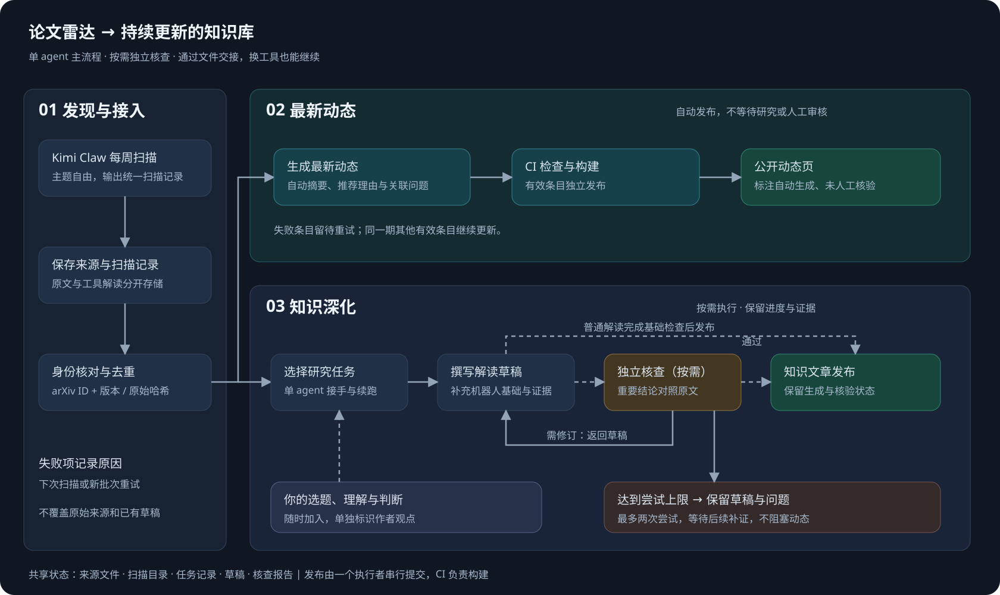

# 论文雷达与知识维护工作流

主要读者：已有机器学习基础，正在进入机器人领域的人。默认解释机器人特有的概念，允许个人选题和新主题，不将所有材料强行归入三个问题。



## 运行方式

扫描由现有 Kimi Claw 定时任务触发；仓库不新建第二个扫描定时器。Kimi 的产物接口目前需要实际接入，不能把下面的本地接口视为已经配置远端自动任务。

```text
raw/arxiv/           arXiv 原始 Atom 响应；不可变，按基础 ID + 版本保存
radar/reports/weekly/  历史轮换周报及 JSON（二手整理）
radar/reports/embodied/  专项周报的目标归档位置（按需创建）
radar/scans/         扫描输入、已接收条目、失败原因；保留工具判断
radar/catalog.json   已接收论文版本目录；不携带 verified
radar/tasks/         单篇研究任务、负责人、产物、尝试次数与下一步
radar/reviews/       按需独立核查报告
drafts/             研究草稿，不进入网站构建
wiki/updates.md      构建时生成的公开动态页；明确标注未人工核验
```

扫描原始报告与工具摘要不放进 raw。当前输入支持现代 arXiv ID；旧式 ID、DOI、公司新闻、开源项目先保留扫描报告，后续另加适配器，不伪造论文身份。

## Kimi Claw 输入协议

每期输出一个 JSON 文件，格式参考 `templates/scan.example.json`。该示例只有占位解读，不可直接作为真实扫描发布。

可直接交给 Kimi Claw 的扫描提示词与字段说明见 [扫描产出模板](../templates/kimi-claw-scan.md)。

模板已对齐 2026-10-06 导出的设置：保留五领域周轮换、综述优先的阅读顺序，以及 human-data-training / Danfei Xu 具身专项。在现有 `paperradar/weekly/` 和 `paperradar/biweekly/` Markdown 报告旁新增同名 JSON。三个问题只用于关联，不改变扫描顺序。专项任务目前实际每周三执行；远端任务与轮换状态尚未由本仓库修改。

- `schema_version` 固定为 `1`。
- `scan_id` 唯一且不可变，例如 `2026-W41-robotics-01`。修改内容或重试失败项时使用新的 scan_id。
- `scanned_at` 是带时区的获取时间；不能冒充论文发表时间。
- 历史报告缺少可靠扫描时间时，保留估计值并加 `scanned_at_source: report_file_mtime`、`historical_record: true`；`converted_at` 单独记录实际格式转换时间。动态页将显示时间估计，不把它标为发现时间。新扫描默认 `actual_scan`。
- `producer` 填实际使用的工具/版本，未知版本不补造。
- `arxiv_id` 是基础 ID；`arxiv_version` 可省略，接入时从 arXiv 确认实际版本。
- `summary` 与 `selection_reason` 是工具解读，不是原文摘要或作者个人判断。
- `tags` 自由选题；`questions` 可为空，或使用 `world-model-planning`、`human-video-transfer`、`robot-deployment`。

在仓库根目录运行：

```bash
python3 scripts/radar_pipeline.py ingest --input /absolute/path/weekly-scan.json
python3 scripts/radar_pipeline.py validate
python3 scripts/radar_pipeline.py render
python3 -m pip install -r requirements-dev.txt
python3 -m unittest discover -s tests -v
python3 scripts/validate_okf.py
```

接入程序访问 arXiv API，核对身份并使用官方标题与日期。它保存原始响应，不证明工具解读正确。重复论文版本保留首次解读和已有任务；新版本另建记录，避免覆盖人工内容。

一条失败不阻塞其他条目。部分失败返回退出码 `2`，有效条目已经接收；退出码 `1` 表示批次级错误。接入方必须检查报告：`2` 时允许校验通过的有效目录进入发布，但要保留失败记录；不能把退出码 `2` 当成全部成功或全部回滚。网络重试使用新的 scan_id。输入逐条处理，arXiv 请求间隔至少三秒。

## 两条发布路径

**最新动态**：接收有效目录 → 生成动态页 → 构建通过 → 推送 main 后 Pages CI 发布。不等待研究任务、独立核查或人工审核。整个批次全部失败时，不宣称本周没有新论文；检查 `radar/scans/` 的失败报告。

**知识深化**：按需选择任务 → 单 agent 撰写草稿 → 重要判断交独立核查 → 修订或停放 → 维护 agent 整合到 wiki。草稿暂存 `drafts/`，本轮没有配置自动 LLM 调用或自动将草稿提升到 wiki 的服务。

新知识文章采用 `templates/article.md` 的 OKF 字段。未审核草稿仍可作为明确标注的知识文章发布；不得写入不存在的 `verified`。任务 `completed` 只表示本次研究产物完成，不表示人工审核通过或已经发布。

原文报告、模型理解、作者观点分别标注。核查者对照原文，并逐项报告数字、实验条件、来源位置和无法确认的问题；一个“通过”分数不能替代证据。

## 文件交接与任务续跑

```bash
python3 scripts/research_task.py 2506.09985v1 in_progress --owner kimi-claw
python3 scripts/research_task.py 2506.09985v1 needs_review --owner kimi-claw --artifact drafts/2506.09985v1.md
python3 scripts/research_task.py 2506.09985v1 completed --owner kimi-claw --report radar/reviews/2506.09985v1.json
```

这些命令仅适用于已经存在的任务。重要任务开始前将其 `independent_review_required` 设置为 `true`。负责人根据核查报告提交状态，不让核查 agent 冒名接管。报告格式参考 `templates/review.example.json`。

核查报告对应论文、草稿路径和内容哈希；核查后若草稿改变，旧报告失效。机器无法单凭报告验证核查者身份或语义正确性，因此它记录机器检查，不能自动写成人工认可。

失败后由当前负责人停放，并写明下一步：

```bash
python3 scripts/research_task.py 2506.09985v1 parked --owner kimi-claw --note '缺少真机实验条件；下一步查看论文附录'
```

其他工具可接手 parked 任务。每次进入 in_progress 消耗一次尝试，默认最多两次；到达上限后保留问题记录，不无限调用模型。重新开始需明确调整范围和尝试预算。任务未完成时禁止另一个工具覆盖其负责人；跨机器接手从最新 Git 状态开始。

## CI 与发布职责

- PR 与 main push 执行脚本测试、原始来源哈希及目录一致性检查。
- Pages 部署流程自己执行同样的检查，再构建；不依赖另一个并行检查流程是否先完成。
- 扫描发布者只提交本期 raw、radar 产物；动态页构建时生成。维护者处理脚本与文章改动。
- 所有写入、提交和推送串行执行；先拉取最新 main，不强推。脚本自身不自动提交、推送或调用模型。
- 本轮完成仓库侧接口、任务状态、动态生成和检查规则；Kimi 定时任务的输出位置、权限及发布配置仍需核实接入。

## 历史论文吸纳

历史周报统一保存在 radar/reports/weekly，原导出索引在 radar/exports。raw 中不保留周报。scripts/audit_radar_archive.py 按本地 ID 和来源声明生成收录清单，scripts/render_radar_archive.py 生成网站历史论文入口，保留周报解读与原文链接的区别。归档推荐不代表结论已核验，也不直接转为稳定知识文章；重要论文后续通过研究任务对照原文深化。当前 216 个 ID 中 215 个已有 PDF 原文提取 Markdown；2601.10999 保留并标为已撤回、仅供历史参考。2503.29237 的引用未得到确认，按用户要求排除，历史周报原文不改写。

## 首批历史 ingest 结果

有效记录已正常接入，无需逐篇人工挑选：215 个官方论文版本、215 个研究任务，其中 214 个 pending，撤回的 2601.10999v2 为 parked。历史批次失败与重试记录保存在 radar/scans，汇总见 radar/ingest-summary.json。2605.0645 来源身份未确认，不进入目录或任务；原周报写 2605.0645x，先前取得的 PDF 与周报标题不符，原文留档已明确警示。请求身份匹配与哈希校验不代表论文摘要已核验。

## 本地 PDF 命名

ID-only PDF 下载完成后运行 `python3 scripts/rename_local_pdfs.py` 预览，再运行 `python3 scripts/rename_local_pdfs.py --apply`。用已确认目录中的首次发布日期与官方标题生成 `YYYY-MM-DD-title-slug-arxiv-ID.pdf`；明确版本后缀原样保留，不把目录最新版本冒充本地 PDF 版本。已有描述性文件名保留；缺少确认身份的文件不猜测命名。作者简写暂不加入，避免未知作者或重名。

重命名报告保存于 `radar/pdf-renaming-report.json`，记录旧名、新名及原文件 SHA-256；同步下载与转换清单、收录清单和原文提取头部的本地 PDF 引用。提取 Markdown 的公开路径保持稳定，PDF 不进入 Git。

## 局限性的写法

局限性随对应论文笔记维护，用简短、概述性的语言说明适用条件和证据边界，不另建独立分析文章或重复任务队列。研究主线只保留必要的综合判断与论文入口。

可以参考其他论文摘要或解读中对目标工作的引用与局限性评价，注明评价来源和具体位置；区分目标论文自述、其他论文评价与模型解读。未回到目标原文确认的评价保留“待核对”标记，不据此补造结论；后续证据在原笔记更新。

已消化论文的简短局限性写在独立论文笔记的 `## 局限性` 中，头部用 `arxiv_id` 标识论文。历史雷达通过收录清单中的笔记路径读取此段更新展示，不重复维护该段文字；未消化论文保留雷达原有局限描述。历史周报、历史扫描阅读范围保持原样，补充分析的来源与阅读范围由笔记记录。
